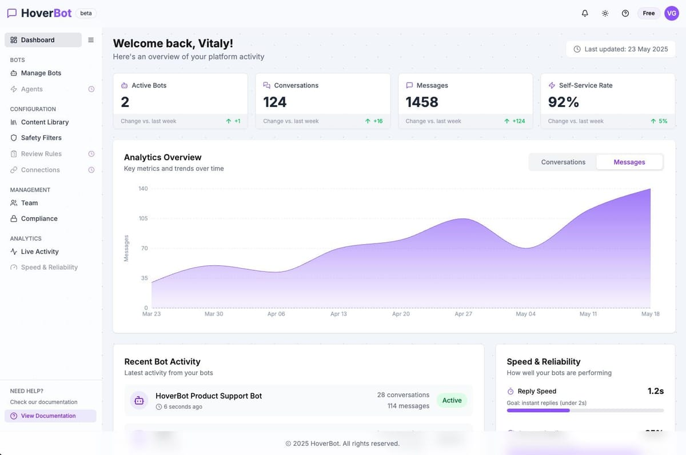

  <a href="https://www.hoverbot.ai">
    <picture>
      <source media="(prefers-color-scheme: dark)" srcset="assets/hoverbot-logo-on-dark.svg">
      
    </picture>
  </a>

<h3 align="center">Product-aware AI chat for ecommerce and marketplace teams.</h3>

  
  
  
  
  

 

HoverBot is an AI chatbot platform for customer support and lead capture. It grounds every answer in a company's own catalog, policies, and documentation using retrieval-augmented generation, masks personal data before it reaches the model, and hands conversations to human agents when confidence drops.

<table>
  <tr>
    <td width="50%" valign="top">
      <b>Grounded answers</b> 
      Replies come from your live product catalog, policies, and docs, so they stay accurate as the content changes.
    </td>
    <td width="50%" valign="top">
      <b>Private by default</b> 
      Personal data is masked before it reaches the model. Topic boundaries and content filters keep conversations in scope.
    </td>
  </tr>
  <tr>
    <td width="50%" valign="top">
      <b>Human handoff</b> 
      Confidence-based routing escalates to a human agent with the full conversation attached.
    </td>
    <td width="50%" valign="top">
      <b>One setup, every channel</b> 
      One knowledge base serves the website widget and WhatsApp Business, and feeds your helpdesk and CRM over webhooks and a REST API.
    </td>
  </tr>
</table>

  <picture>
    <source media="(prefers-color-scheme: dark)" srcset="assets/hoverbot_dashboard_dark.jpeg">
    
  </picture>

### Open source

| Repository | What it is |
| --- | --- |
| [hoverbot-chatbot-client](https://github.com/HoverBotAI/hoverbot-chatbot-client) | A lightweight chatbot widget client for the HoverBot platform. MIT licensed. |

### At a glance

|  |  |
| --- | --- |
| **Founded** | 2024 |
| **Headquarters** | Singapore |
| **Category** | AI chatbot management platform |
| **Channels** | Website widget, WhatsApp Business |
| **Compliance** | GDPR and PDPA controls active; SOC 2 Type II in progress ([Trust Center](https://www.hoverbot.ai/trust-center)) |

### Contact

Questions, partnerships, or media enquiries: [support@hoverbot.ai](mailto:support@hoverbot.ai) or [hoverbot.ai/contact](https://www.hoverbot.ai/contact).
Logos, boilerplate, and screenshots are in the [press kit](https://www.hoverbot.ai/press).
